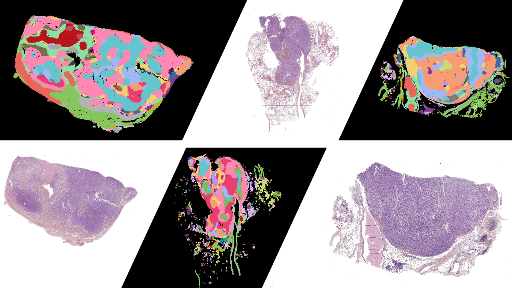

# Spatial PCA for WSIs: 
Spatial Principal Component Analysis (PCA), proposed by [L. Shang and X. Zhou, NAT COM 2022](https://www.nature.com/articles/s41467-022-34879-1), has been developed to project single cell data into a lower dimensional space while integrating the spatial information into the modelling. Here, we proposed an adaptation of the method for whole slide images (WSIs). To get a low-dimensional representation of these huge images (~20,000 x 20,000 pixels), they are sliced into patches called tiles. For each tile, a vector of features is computed by training a deep learning model; see our [Barlow Twins implementation for WSIs](https://github.com/IARCbioinfo/LNENBarlowTwins/tree/master). These encoded vectors are independent of the tile positions within a WSI. However, we can assume that tiles that are close to each other are more likely to have a similar representation in feature space than distant tiles, as they are more likely to share common morphological features. To model this assumption, we adapted [spatial PCA](https://www.nature.com/articles/s41467-022-34879-1) by removing variable selection and using a multi-samples strategy. Given the quadratic memory and time cost of the algorithm, a random set of vectors must be selected for each patient (~185 tiles per patient), experimentally 50,000 encoded vectors are sufficient to produce a consistent latent space. Intermediate matrices extracted from the SpatialPCA R object created are then used to project new vectors into the low-dimensional space created by the spatial PCA (see supplementary method equation 13  of  [L. Shang and X. Zhou, NAT COM 2022](https://www.nature.com/articles/s41467-022-34879-1)).

- Original article: [L. Shang and X. Zhou, NAT COM 2022](https://www.nature.com/articles/s41467-022-34879-1).
- Original code: [https://github.com/shangll123/SpatialPCA_analysis_codes](https://github.com/shangll123/SpatialPCA_analysis_codes)
- Method used to obtain a spatially informed low-diension represention in "Assessment of the current and emerging criteria for the histopathological classification of lung neuroendocrine tumours in the lungNENomics project." ESMO Open 2023 (under review)

## Installation
- Clone this repository: tested on R 4.1.2
- All needed packages will be install automatocally when the script will be launches
- Please note that the original functions of [Spatial PCA package](https://github.com/shangll123/SpatialPCA_analysis_codes) are override by the ones in `ImgSpatialPCA.R` and `ImgSpatialPCAMultipleSamles.R`. 

## Organization of the repository
- `RunMultiSPCARandomSampling.R` allows the Spatial PCA to be run.
- `ImgSpatialPCA.R` contains the based function to create the Spatial PCA and overrides `CreateSpatialPCAObject` function of the original package.
- `ImgSpatialPCAMultipleSamles.R` adapted the Spatial PCA to several samples and overrides `SpatialPCA_Multiple_Sample` function of the original package.

## Step 1: Creation of the Spatial PCA latent space  
- To create a spatial PCA R object run `RunMultiSPCARandomSampling.R` an example of configuration file is given in `RunSpatialPCA50K.sh`
- Command line for cluster running with slurm
```
sbatch RunSpatialPCA50K.sh
```
### Description of the process

1. Load encoded vectors created by a deep-learning model, those ones have to be concatenated in a single csv file such as (see argline `path2projectors`):

|   | X0           | X1            | X2          | X3            | ... | X124         | X125         | X126         | X127         | img_id                  | sample_id   | img_id_c               | x           | y           |
| - | ------------ | ------------- | ----------- | ------------- | --- | ------------ | ------------ | ------------ | ------------ | ------------------------ | -------- | ---------------------- | ----------- | ----------- |
| 1 | 0.010731053  | -0.017491885  | -0.05379057 | 0.0060576447  | ... | -0.021526879 | 0.038895514 | 0.021861676 | -0.0008289963 | TNE1019_30721_19585     | TNE1019  | TNE1019_30721_19585   | 30721       | 19585       |
| 2 | 0.0031735892 | -0.0024470983 | -0.04042089 | 7.895916e-05  | ... | -0.01900657  | -0.0067212125| 0.0070669674| -0.015635846  | TNE1019_33409_28801     | TNE1019  | TNE1019_33409_28801   | 33409       | 28801       |

2. Extraction of n random row of in the data frame (n = `n_tiles`).
3. Creation of lists of tables of features and coordinates per samples.
4. Creation of the Spatial PCA considering the *first 20 principal components*.
5. Save the SpatialPCA R object and coordinates in `output_folder`.

- :warning: WARNING :warning:
    - For a representation containing 100,000 encoded vectors, a machine with 300 GB of RAM is required, and the R object that is created has a size of 6 GB. 
    - The encoded vectors must not be normalised, this step is included in the pipeline.

## Step 2: Projection 
- To project additional tiles' repsentations onto the low dimensional space created by the spatial PCA, the script `ProjectionElaboratedByPatient.R` can be used. An example of configuration is given in `Sbacth_ProjectionByPatient.sh`
- Command line on a cluster working with slurm:
```
sbatch Sbacth_ProjectionByPatient.sh
```
### Description of the process 

1. Load the R SpatialPCA object created in the previous step (see argline parameter `spca_obj`)
2. Load the **encoded vectors created by a deep-learning model** which must be **centred and standardised**, and must follow the following structure (see argline `proj_tab_norm`) :

|   | X0           | X1            | X2          | X3            | ... | X124         | X125         | X126         | X127         | img_id                  | sample_id   | img_id_c               | x           | y           |
| - | ------------ | ------------- | ----------- | ------------- | --- | ------------ | ------------ | ------------ | ------------ | ------------------------ | -------- | ---------------------- | ----------- | ----------- |
| 1 | 0.5090191117 | -0.9064313876 | -2.726900674 | 0.274636068  | ... | 1.0504566226 | 1.9215368440 | 1.0672475244 | -0.0707460975 | TNE1019_30721_19585     | TNE1019  | TNE1019_30721_19585   | 30721       | 19585       |
| 2 | 0.1726495568 | -0.1714783594 | -2.496432701 | -0.016819896 | ... | 0.0436065054 | 1.2325113930 | 1.7371222537 | 0.3325003079 | TNE1019_33409_28801     | TNE1019  | TNE1019_33409_28801   | 33409       | 28801       |

3. Extraction of encoded vectors belonging to the patient of interest (see argline `sample_id`)
4. The patient's encoded vectors are projected into the latent space of the spatial PCA.
5. The new tiles representations are saved in the folder defined by the `outdir` argument under the following file name `{outdir}/Proj_{sample_id}.csv`.

## Step 3: Search Leiden communities

- To search for morphological clusters we applied the [Leiden community detection](https://www.nature.com/articles/s41598-019-41695-z) methods on the low dimensionnal representations of the the tiles obtained through the spatial PCA.
- The algorithm is implemented in `LeidenCommunitySpatialPCA.R`, the configuration used in our ESMO open paper are described in `RunLeidenCommunity.sh`.

### Description of the process 
1. Load all spatial PCA projections concatenated in a single csv file (see argline `proj_tab_SPCA`) with the following architecture:

|   | img_id_c             | axis_1          | axis_2          | axis_3          | axis_4          | ... | axis_19         | axis_20         | sample_id               | x          | y          |
| - | -------------------- | --------------- | --------------- | --------------- | --------------- | --- | --------------- | --------------- | ---------------------- | ---------- | ---------- |
| 1 | TNE0001_8065_37633   | -0.2425984449   | -1.5822019878   | 0.2216062175    | -0.7004538129   | ... | 0.0645403598   | 0.1015841795   | TNE0001 | 8065       | 37633      |
| 2 | TNE0001_22657_31489  | -0.8694107393   | -0.3258183767   | -0.3124274849   | -0.1520251365   | ... | 0.08048248997  | -0.03595781844 | TNE0001 | 22657      | 31489      |

2. Samples randomly n rows (see argline `ntiles`)
3. Create a graph based on the K-nearest neighbors of each projection (see argline `KNN`)
4. Seach community of nodes according to the Leiden method (see argline `Resolution`)
5. Save cluster centroids in a file name `{outputdir}/SPCA_centroids_leiden_ntiles_{ntiles}_KNN_{KNN}_Res_{Resolution}_ncluster_{n_clusters_leiden}.csv`

## Step 4: Assigning a community to each spatial PCA projection
- The `ClosestCentroids.R` script is used to assign a community to each projection from the spatial PCA, based on the minimum distance between a projection and the centroids of the Leiden communities. An example of a slurm query is given in `RunClosestCentroids.sh`.
 ### Process description 
 1. Load all concatenated PCA spatial projections into a single csv (see argline `proj_tab_SPCA`). **This must be the same file as in step 3.1**.
 2. Extract the projections of the patient of interest (see argline `sample_id`)
 3. Load the coordinates of the centroids of the Leiden communities (see command line `centroids_tab`), this table must have the following format:

 |   | cluster | axis_1          | axis_2          | axis_3          | axis_4          | ... | axis_19         | axis_20         |
| - | ------- | --------------- | --------------- | --------------- | --------------- | --- | --------------- | --------------- |
| 1 | 1       | 1.0776234132    | 0.3351948348    | -0.561474021    | -1.1364130733   | ... | -0.2101122186  | -0.1931117565  |
| 2 | 2       | -1.4632848979   | 0.8883086482    | -0.3643381155   | -0.8784518651   | ... | -0.0111574198  | 0.03596174487  |

4. Each projection is assigned to a community according to the minimum distance to one of the centroids of the Leiden communities.
5. For the patient concerned, the vectors resulting from the projection carried out by the spatial PCA and the Leiden community associated with this projection are recorded in a file with the following format `{outdir}/SPCA_centroids_leiden_ntiles100000_KNN_6000_Res_01_{sample_id}.csv`. This table will have the following format:

|   | img_id_c              | axis_1          | axis_2          | axis_3          | axis_4          | ... | axis_19         | axis_20         | sample_id    | x      | y      | cluster |
| - | --------------------- | --------------- | --------------- | --------------- | --------------- | --- | --------------- | --------------- | ----------- | ------ | ------ | ------- |
| 1 | TNE0001_8065_37633    | -0.2574942826   | -1.6276659801  | 0.1956646737    | -0.7829603307   | ... | 0.0844771901    | 0.1201035516    | TNE0001     | 8065   | 37633  | 5       |
| 2 | TNE0001_22657_31489   | -0.8777365627   | -0.3758480951  | -0.299188705   | -0.2703297597   | ... | 0.04097749198   | -0.09903248588  | TNE0001     | 22657  | 31489  | 8       |

## TO DO LIST
- :construction: Random forest